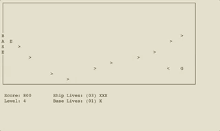

# Space Game

A space defense game written in C using NCURSES. Inspired by Space Impact, on the Nokia 3310 et seq.

## Directions
* <kbd>←</kbd><kbd>↑</kbd><kbd>↓</kbd><kbd>→</kbd> : Move ship
* <kbd>space</kbd> : Shoot
* <kbd>p</kbd> : Pause
* <kbd>q</kbd> : Quit

## Installation
Dependencies: `ncurses` (installed by default on most Macs)

**Mac**
1. Open Terminal: <kbd>cmd</kbd>+<kbd>space</kbd>, search "Terminal"
2. Move to your preferred directory, e.g., run `cd Downloads`
3. Run `git clone https://github.com/eugenekkim8/space_game.git`
4. Run `cd space_game`
5. Run `make`
6. Run `bin/release/main` to launch.
7. To uninstall, run `cd -` and then `rm -r space_game` (accepting any overrides).

**Windows**

Install [Cygwin](https://www.cygwin.com/) with packages `git`, `gcc`, `make`, `ncurses` and `libncurses-devel` and follow the Mac instructions above.

This game has not been tested on Windows. 
